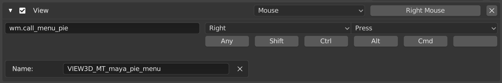

# mayaっぽいkeymap
Navigationや選択の挙動はもうちょっとMaya寄りに、かつ基本的なショートカットは出来るだけBlenderのデフォルトまま、そんなプリセット。

## Install

1. Preferences -> Add-ons -> Install -> mayaPieMenu.py
2. Preferences -> Keymap -> Import -> keymap.py
3. Preferences -> Input -> Mouse -> Emulate 3 Button Mouse(ON)

## Keymap変更点

### 3D View

#### Custom Pie Menu

* 3D View → Object Mode → Object Mode (Global) → Disable: Call Menu(Right Mouse)
* 3D View → Object Mode → Object Mode (Global) → New Keymap
* 3D View → Mesh → Mesh (Global) → Disable: Call Menu(Right Mouse)
* 3D View → Mesh → Mesh (Global) → New keymap
* 3D View → Curve → Curve (Global) → Disable: Call Menu(Right Mouse)
* 3D View → Curve → Curve (Global) → New keymap
* Image → UV Editor → UV Editor (Global) → New keymap

* **New keymap**

    

#### Alt navigation

MayaのAltナビゲーション。

* 3D View → 3D view(global) → Pan View → 'Alt Middle Mouse'に変更
* 3D View → 3D view(global) → Zoom View → 'Alt Right Mouse'に変更

#### F key focus

フォーカスは頻繁に使うのでMayaと同じFキーに変更。デフォルトの'Numpad . 'は使用頻度の割に遠すぎる。

* 3D View → 3D View (global) → View Selected → Fに変更
* 3D View → Mesh → Mesh (global) → New keymap (view3d.view_selected)を作成
* 3D View → Mesh → Mesh (global) → Make Edge/Face → Disable

    (元々の'Make Edge/Face'は失われるがVertexメニューからアクセス可能)

* 3D View → Curve → Curve (global) → New keymap (view3d.view_selected)を作成
* 3D View → Curve → Curve (global) → Make Segment → Disable

    (元々の'Make Segment'は失われるがカーブコンテキストメニューからアクセス可能)

* Image → Image (global) → Disable "View Center"
* Image → Image (global) → New Keymap F: image.view_selected

#### Disable tweak move/translate

マニピュレーターの外をドラッグするとオブジェクトが動いてしまうのを防止

* 3D View → 3D View(global) → Move(Tweak Left Any) → Disable
* 3D View → Object Mode → 3D View Tool: Transform → Disable

#### WER object mode

Mayaと同じWERキーによるマニピュレータの切り替え

* 3D View → Object Mode → Object Mode (Global) → New Keymap W: wm.tool_set_by_id, builtin.move
* 3D View → Object Mode → Object Mode (Global) → New Keymap E: wm.tool_set_by_id, builtin.rotate
* 3D View → Object Mode → Object Mode (Global) → New Keymap R: wm.tool_set_by_id, builtin.scale
* 3D View → Curve → Curve (Global) → New Keymap W: wm.tool_set_by_id, builtin.move
* 3D View → Curve → Curve (Global) → New Keymap E: wm.tool_set_by_id, builtin.rotate
* 3D View → Curve → Curve (Global) → New Keymap R: wm.tool_set_by_id, builtin.scale

#### WER mesh mode

* 3D View → Mesh → Mesh (Global) → New Keymap W: wm.tool_set_by_id, builtin.move
* 3D View → Mesh → Mesh (Global) → New Keymap E: wm.tool_set_by_id, builtin.rotate
* 3D View → Mesh → Mesh (Global) → New Keymap R: wm.tool_set_by_id, builtin.scale
* 3D View → Mesh → Mesh (Global) → Extrude and Move on Normals → Disable

#### WER UV Editor
* Image → UV Editor → UV Editor (Global) → New Keymap W: wm.tool_set_by_id, builtin.move
* Image → UV Editor → UV Editor (Global) → New Keymap W: wm.tool_set_by_id, builtin.rotate
* Image → UV Editor → UV Editor (Global) → New Keymap W: wm.tool_set_by_id, builtin.scale
* Image → UV Editor → UV Editor (Global) → Disable: Rotate E key

#### Box Selection while using transform manipulator

マニピュレータを表示させた状態で追加のBox選択を可能にする

https://blender.stackexchange.com/questions/124195/blender-2-8-enter-select-box-mode-while-in-transform-mode

* 3D View → Object Mode → 3D View Tool: Move → Add New →
    * view3d.select_box
    * Tweak Left Any
    * Mode: New

これのみの場合Shiftドラッグによる追加と削除ができないのでShift用にもう一つキーマップを作製

* 3D View → Object Mode → 3D View Tool: Move → Add New →
    * view3d.select_box
    * Tweak Left Any (Shift modifier)
    * Mode: Difference
* 3D View Tool: Rotate, 3D View Tool: Scaleにも同じ変更

本来の挙動をCtrlで呼び出せるようにする

* 3D View → Object Mode → 3D View Tool: Move → Move → Add Ctrl modifier
* 3D View → Object Mode → 3D View Tool: Rotate → Rotate → Add Ctrl modifier
* 3D View → Object Mode → 3D View Tool: Scale → Scale→ Add Ctrl modifier

#### Box select

通常のBox選択も同じ挙動に
* 3D View -> Object Mode -> 3D View Tool: Select Box -> 上から2つ目のModeをDifferenceに。
* 3D View -> Object Mode -> 3D View Tool: Select Box -> 上から4つ目のModeをExtendに。

### View 2D

node editorやCompositeでもAltナビゲーション

* View 2D →  Zoom 2D View → "Alt Right Mouse"に変更
* View 2D → Add New → view2d.pan : Alt Middle Mouse

### Image
Image viewやUV viewでもAltナビゲーション
* Image → Image(global) → Pan View → 'Alt Middle Mouse'に変更
* Image → Image(global) → Zoom View → 'Alt Right Mouse'に変更

### Knife Tool

右クリックで次のカット（Enterで確定する必要あり）
* 3D View -> Knife Tool Modal Map -> Cancel -> Disable
* 3D View -> Knife Tool Modal Map -> New Keymap (End Current Cut: Right Mouse)

## Keymap以外の設定

### Preferences

#### Interface
* Display : Python Tooltips (Script書くとき便利)

#### Themes
* Node Editor -> Noodle Curving : 5 or 好きな値(ノードエディタの線はカーブしてほしい)

#### Input

* Keyboard : Emulate Numpad (Numpadがない人)
* Mouse : Emulate 3 button mouse

#### Navigation

* Zoom : Zoom axis -> Vertical or Horizontal

	MayaはAltでズームするときに上下左右両方対応しているがBlenderはどちらかしかダメそう。
普段の手癖に合わせて変更

### Scene Properties

#### Units

1 unit = 1cm にする

* Unit System : Metric
* Length: Centimeters

### カメラ

* Nキー → ビュー → Lock Camera to View ON

    これをしないとカメラビューの時Alt操作でカメラを動かせない
