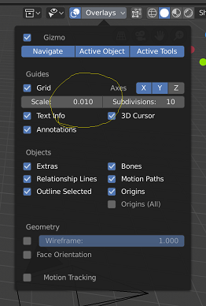
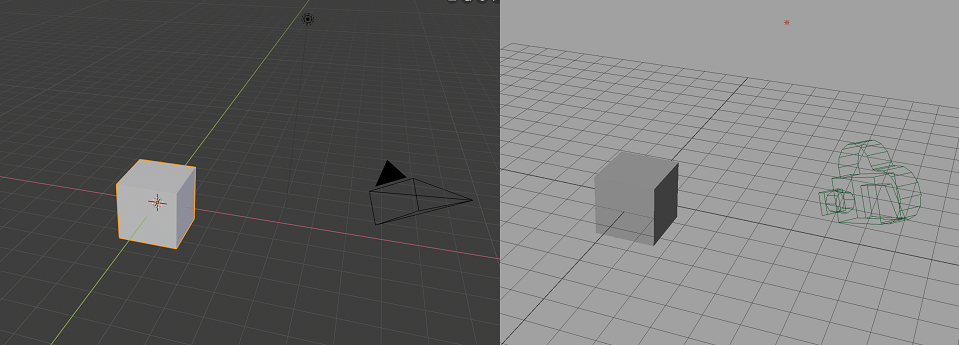

# mayaっぽいkeymap

## Keymap変更点

### 3D View

**Alt navigation**

MayaのAltナビゲーション。

* 3D View → 3D view(global) → Pan View → 'Alt Middle Mouse'に変更
* 3D View → 3D view(global) → Zoom View → 'Alt Right Mouse'に変更

**F key focus**

フォーカスは頻繁に使うのでMayaと同じFキーに変更。デフォルトの'Numpad . 'は使用頻度の割に遠すぎる。

* 3D View → 3D View (global) → View Selected → Fに変更
* 3D View → Mesh → Mesh (global) → New keymap (view3d.view_selected)を作成
* 3D View → Mesh → Mesh (global) → Make Edge/Face → Disable

**Disable tweak move/translate**

マニピュレーターの外をドラッグするとオブジェクトが動いてしまうのを防止

* 3D View → 3D View(global) → Move(Tweak Left Any) → Disable
* 3D View → Object Mode → 3D View Tool: Transform → Disable

**WER object mode**

Mayaと同じWERキーによるマニピュレータの切り替え

* 3D View → Object Mode → Object Mode (Global) → New Keymap W: wm.tool_set_by_id, builtin.move
* 3D View → Object Mode → Object Mode (Global) → New Keymap E: wm.tool_set_by_id, builtin.rotate
* 3D View → Object Mode → Object Mode (Global) → New Keymap R: wm.tool_set_by_id, builtin.scale

**WER mesh mode**

* 3D View → Mesh → Mesh (Global) → New Keymap W: wm.tool_set_by_id, builtin.move  
* 3D View → Mesh → Mesh (Global) → New Keymap E: wm.tool_set_by_id, builtin.rotate
* 3D View → Mesh → Mesh (Global) → New Keymap R: wm.tool_set_by_id, builtin.scale 
* 3D View → Mesh → Mesh (Global) → Extrude and Move on Normals → Disable

**Box Selection while using transform manipulator**

マニピュレータを表示させた状態で追加のBox選択を可能にする

https://blender.stackexchange.com/questions/124195/blender-2-8-enter-select-box-mode-while-in-transform-mode

* 3D View → Object Mode → 3D View Tool: Move → Add New →
    * view3d.select_box
    * Tweak Left Any
    * Mode: New

これのみの場合Shiftドラッグによる追加と削除ができないのでShift用にもう一つキーマップを作製

* 3D View → Object Mode → 3D View Tool: Move → Add New →
    * view3d.select_box
    * Tweak Left Any (Shift modifier)
    * Mode: Difference
* 3D View Tool: Rotate, 3D View Tool: Scaleにも同じ変更

本来の挙動をCtrlで呼び出せるようにする

* 3D View → Object Mode → 3D View Tool: Move → Move → Add Ctrl modifier
* 3D View → Object Mode → 3D View Tool: Rotate → Rotate → Add Ctrl modifier
* 3D View → Object Mode → 3D View Tool: Scale → Scale→ Add Ctrl modifier

**Box select**

通常のBox選択も同じ挙動に
* 3D View -> Object Mode -> 3D View Tool: Select Box -> 上から二つ目のModeをDifferenceに。

### View 2D

node editorやCompositeでもAltナビゲーション

* View 2D →  Zoom 2D View → "Alt Right Mouse"に変更
* View 2D → Add New → view2d.pan : Alt Middle Mouse

### Image
Image viewやUV viewでもAltナビゲーション
* Image → Image(global) → Pan View → 'Alt Middle Mouse'に変更
* Image → Image(global) → Zoom View → 'Alt Right Mouse'に変更

### Knife Tool

右クリックで次のカット（Enterで確定する必要あり）
* 3D View -> Knife Tool Modal Map -> Cancel -> Disable
* 3D View -> Knife Tool Modal Map -> New Keymap (End Current Cut: Right Mouse)

## Keymap以外の設定
### シーンプロパティ
#### Units
1 unit = 1cm にする
* Unit System : Metric
* Unit Scale : 0.01

すると３Dビューのグリッドがでかくなるのでグリッドサイズを調整する
 

Mayaのデフォルトと一緒になる

### カメラ

* Nキー → ビュー → Lock Camera to View ON

    これをしないとカメラビューの時Alt操作でカメラを動かせない
